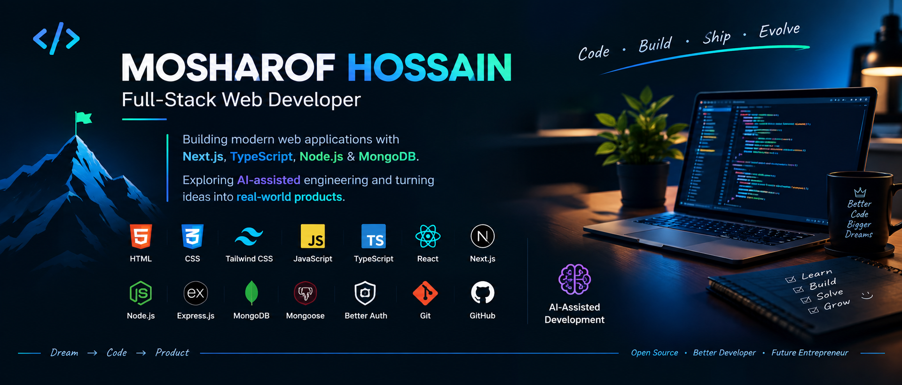

  

# Hi, I'm Mosharof Hossain 👋

### Full-Stack Web Developer | JavaScript & TypeScript | Next.js | Node.js | AI-Assisted Development

I build modern, scalable and user-focused web applications using
JavaScript/TypeScript across the frontend, backend and database layers.

I am focused on becoming a strong Full-Stack Web Developer with a
modern AI-assisted engineering workflow.

---

## 👋 About Me

I’m a **Full-Stack Web Developer** passionate about building modern, scalable, and user-focused web applications.

I work across the full web development stack — from creating responsive interfaces to building backend APIs, databases, authentication systems, and deploying production-ready applications.

### 💻 What I Work With

* **Frontend:** HTML, CSS, Tailwind CSS, JavaScript, TypeScript, React, Next.js
* **Backend:** Node.js, Express.js, REST APIs
* **Database:** MongoDB, Mongoose
* **Authentication:** Better Auth, Authentication & Authorization
* **Tools:** Git, GitHub, VS Code, Postman
* **AI Engineering:** AI-assisted coding, debugging, refactoring, testing, documentation, and development workflows

### 🤖 AI-Assisted Development

I use AI as an **engineering tool**, not as a replacement for understanding.

My workflow is:

**Understand → Plan → Build → Review → Test → Debug → Refactor → Deploy**

I focus on understanding the code, making engineering decisions, and building reliable solutions while using AI to improve development speed and problem-solving.

### 🚀 What I’m Building

I’m continuously building real-world projects to strengthen my skills in:

**Frontend → Backend → Database → Authentication → Deployment → AI-Assisted Engineering**

My long-term goal is to become a strong **Full-Stack Engineer and Product Builder**, capable of turning ideas into useful technology products.

> **Learn. Build. Solve. Improve. Repeat.**

## AI-Assisted Development

AI-assisted coding  
AI-powered debugging  
Code generation  
Code refactoring  
Documentation  
Testing assistance  
Problem solving  
AI-assisted development workflow

---

# 🧠 Full-Stack Development

I work across the complete web application lifecycle:

Frontend
        ↓
React / Next.js
        ↓
API
        ↓
Node.js / Express.js
        ↓
Authentication
        ↓
MongoDB
        ↓
Mongoose
        ↓
Deployment

---

# 🔐 Authentication & Security

I am learning and building applications with:

- Authentication
- Authorization
- Session management
- Protected routes
- User roles
- Secure API design
- Better Auth

---

# 🤖 AI-Assisted Development

AI is part of my development workflow, not a replacement for engineering fundamentals.

I use AI to help with:

- Understanding unfamiliar code
- Generating initial implementations
- Debugging
- Refactoring
- Writing tests
- Documentation
- Exploring solutions
- Reviewing code
- Improving development speed

My goal is to understand the code I ship and use AI as an engineering tool.

---

# 📂 Featured Projects

### 🛒 E-Commerce Platform

Full-stack e-commerce application with:

- Next.js
- TypeScript
- Tailwind CSS
- Node.js
- Express.js
- MongoDB
- Mongoose
- Authentication
- Admin Dashboard
- REST API

---

### 📋 Task Management Application

A full-stack task management application featuring:

- React
- TypeScript
- Node.js
- Express.js
- MongoDB
- Authentication
- CRUD operations
- Protected routes

---

### 🔐 Authentication System

Authentication-focused application using:

- Next.js
- Better Auth
- MongoDB
- Mongoose
- Protected routes
- Session management

---
