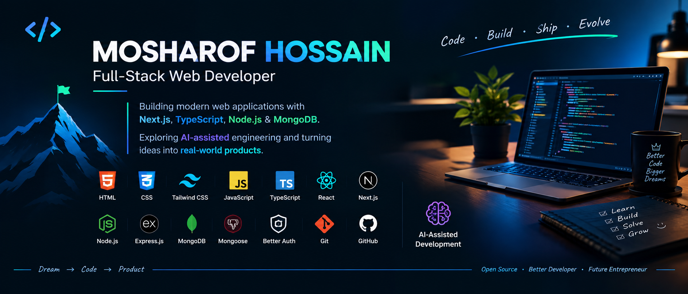

  

  # 👋 Hi, I'm Mosharof Hossain
  ### 🚀 Full Stack Web Developer | AI-Enhanced & Web Engineering Mindset

  

    📍 <b>Location:</b> Dhaka, Bangladesh &nbsp;|&nbsp; 💼 <b>Available for:</b> Remote & On-site Opportunities
  

  <!-- Social Badges with Direct Mailto Link -->
  

    
    
    
  

  

---

### 💡 Daily Motivation

> *"Code is like humor. When you have to explain it, it’s bad."* — **Cory House**
> 
> *"The best way to predict the future is to invent it with scalable code and AI-driven solutions."*

---

### 👨‍💻 About Me

- 🔭 **Role & Focus:** Full Stack Web Developer driven by a **Web Engineering Mindset** and **AI-Enhanced workflows**.
- 🛠️ **What I Do:** Building robust, scalable, and user-centric web applications from concept to deployment.
- ⚡ **Problem Solver:** Passionate about writing clean, maintainable, and type-safe code using modern web architecture.
- 🤖 **AI Integration:** Leveraging cutting-edge AI tools to accelerate development speed, code optimization, and UX quality.
- 🎯 **Goals:** Constantly upgrading tech skills, contributing to open-source, and solving real-world business challenges.

---

### 🛠️ Tech Stack & Skills

#### 🎨 Frontend Technologies

  
  
  
  
  
  
  
  

#### ⚙️ Backend, Authentication & Database

  
  
  

---

### 📈 GitHub Statistics

  
  

 

  

---

### 🤝 Connect With Me

  
    
  
  

---

  <i>✨ Crafted with precision, driven by passion. Thanks for visiting my profile! ✨</i>

